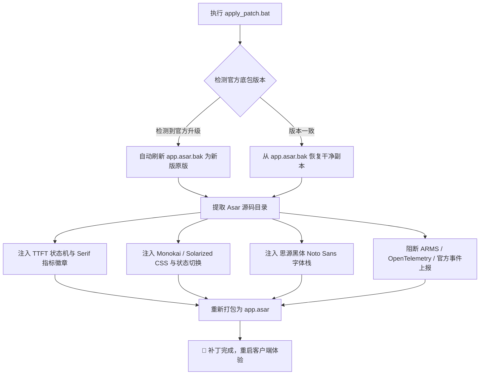

<div align="center">

# 🚀 ZCode-Plus (ZCode 极致体验增强套件)

**专为 ZCode 打造的无侵入式高阶体验补丁 · 深度适配 ZCode v3.14+**

[]()
[]()
[]()
[]()

---

<p align="center">
  <b>⚡ 分步真实 TTFT 监控</b> &nbsp;•&nbsp;
  <b>🎨 Monokai / Solarized 精调主题</b> &nbsp;•&nbsp;
  <b>🔤 思源黑体排版</b> &nbsp;•&nbsp;
  <b>🛡️ 全链路隐私与遥测守卫</b>
</p>

</div>

---

## 📖 项目简介 (Overview)

**ZCode-Plus** 是一套针对 ZCode 桌面客户端的底层增强补丁套件。针对官方客户端在模型推理时延感知、深色界面审美疲劳、中文字体排版质感以及后台后台遥测上报等方面的痛点，ZCode-Plus 通过对客户端核心 Asar 包进行精准的动态注入与模块重构，带来更沉浸、更专业、更安全的开发体验。

---

## ✨ 核心特性一览 (Key Features)

### 1. ⚡ 端到端真实 TTFT 与推理吞吐率监控 (Step-level TTFT & Speed v3)
官方客户端仅能看到粗粒度的完成耗时，而 ZCode-Plus 在每条助手消息下方常驻注入了**微秒级高精度指标条**：
* **分步独立 TTFT (Step-level TTFT)**：
  * **第一步首轮响应 (Step 1)**：以用户提交回车时刻为基准，精确测量模型返回首个 Token 的时间（通常为 `0.8s ~ 1.8s`）。
  * **Agent 多轮工作流 (Step 2+)**：以前序工具执行完毕（Tool Completion）时刻为基准，独立捕获每次推理阶段的真实 TTFT，彻底解决多步调用中 TTFT 统计不准的痛点。
* **分步真实推理速率 (Generation Throughput)**：
  * 仅计算模型纯生成活跃阶段的耗时（严格扣除网络等待、工具本地调用与磁盘 I/O 耗时）。
  * **加权高精度分词统计**：结合当前步骤的**思考过程 (Reasoning Tokens)** 与 **正文回复 (Output Tokens)**，采用中英文加权算法（中文约 0.72 tok/字）实时计算真实的 `t/s` 吞吐速度。
* **视觉美化**：精致优雅的 Serif（衬线体）字体排版，紧凑下边距设计，无需悬停常驻可见。
  > *效果示例*：`⚡ TTFT: 1.15s · 68.5 t/s · 1240 tok (思考 1180 + 回复 60) · 18.2s`

---

### 2. 🎨 经典工业级界面主题（支持在「设置 -> 外观」自由切换）
告别千篇一律的死黑色，带来两款久经考验的经典开发者配色：
* **🌙 Monokai 暖黑 (Monokai Warm Dark)**：
  * 采用经典的暗橄榄深灰色调（`#272822` / `#1e1f1c`），替代刺眼的纯黑（`#161616`）。
  * 完美融合 Monokai 标志性的橄榄绿（`#a6e22e`）、玫粉色（`#f92672`）与暖米白文字（`#f8f8f2`），极佳护眼。
* **☀️ Solarized 浅色 (Solarized Light)**：
  * 忠实还原 Ethan Schoonover 经典的 Base3 暖米黄色背景（`#fdf6e3`）与浅驼色面板（`#eee8d5`）。
  * 搭配青灰蓝文字（`#657b83`）与经典湛蓝强调色（`#268bd2`），温润柔和。

---

### 3. 🔤 思源黑体 (Noto Sans) 全局排版优化
* **UI 字体优化**：优先匹配 `"Noto Sans"` / `"Noto Sans SC"` / `"Noto Sans CJK SC"`，字形更饱满自然，解决部分系统下中文字体发虚发暗的问题。
* **代码块隔离保护**：为 `pre`、`code`、`.font-mono` 保留独立的等宽编程字体，确保缩进字符与对齐不受影响。

---

### 4. 🛡️ 全链路隐私守卫与遥测阻断 (Privacy & Telemetry Shield)
全面清理 3.14 客户端中的隐私泄露隐患与遥测流量：
* **阻断阿里云 ARMS RUM / SLS 行为埋点**：将 `proj-xtrace` 行为监听地址重定向至本地无效地址，拦截用户点击与错误跟踪。
* **阻断 OpenTelemetry APM 链路监控**：将 3.14 新增的分布式追踪上报端点（`/apm/trace/opentelemetry`）彻底熔断。
* **拦截官方 Telemetry 事件与设备指纹上报**：静默短路向 `https://zcode.z.ai/api/v1/event/report` 发送的日常活跃（daily active）与会话打点，防止硬件物理设备指纹（`deviceMid`）被上传。
* **原生工作区快照安全确认**：官方在 3.14 中已彻底废弃并移除了旧版的 `RepoSnapshot`（静默遍历工作区并打包 `.tar.gz.enc` 上传 OSS 机制）。
* **人机验证 (Captcha) 智能放行**：保留阿里云人机滑块验证脚本的正常加载通道，确保在触发账号安全风控时能够正常通过人机校验，**绝不影响日常使用与登录**。

---

### 5. 🔄 智能版本感知与防降级防护 (Smart Version Guard)
* 补丁脚本内置**双重版本比对机制**，在官方客户端发布更新后，自动识别新版本并同步刷新干净备份，**彻底根治因旧备份导致的“打补丁后客户端倒退回旧版”的缺陷**。

---

### 6. ⚡ 初始 Token 暴降 78% · 冗余工具与系统提示词瘦身 (Token Saver & Bloat Cutter)
* **背景痛点**：官方客户端在初始对话时默认挂载了 32 个系统工具，特别是在 `CreateWorkflow` / `SaveWorkflow` 的 Description 里直接塞入了上万字符的 TypeScript Workflow SDK 文档，并默认启用了平时写代码根本用不到的定时与离峰任务，导致初次对话就直接吃掉超过 3.6 万 Token（系统工具独占 3.4 万+ Token）。
* **精准裁剪 16 个写代码完全用不到的冗余工具**（立省 **~26,500 Tokens**）：
  * **工作流全家桶 (Dynamic Workflow)**：`CreateWorkflow`, `SaveWorkflow`, `EvalWorkflowSnippet`, `AmendWorkflow`, `ListWorkflowRuns`, `GetWorkflowRun`, `ResumeWorkflowRun`, `ResolveWorkflowQuestion`, `ListSavedWorkflows`
  * **定时与离峰任务全家桶 (Cron & Off-Peak)**：`CronCreate`, `CronUpdate`, `CronDelete`, `CronList`, `OffPeakCreate`, `OffPeakList`
  * **元查询工具**：`ListModels`
* **完整保留所有核心开发、计划与调试工具**：
  * **计划模式与用户交互**：`AskUserQuestion`、`EnterPlanMode`、`ExitPlanMode` 100% 完整保留！
  * **子智能体调度与通信**：`Agent`、`SendMessage` 100% 完整保留！
  * **代码、文件与终端调试**：`Bash`、`Read`、`Write`、`Edit`、`TaskOutput`、`TaskStop`、`TodoRead`、`TodoWrite`、`WebFetch`、`Skill`、`ReadSessionContext` 全部完好无损！
* **精炼自带系统提示词 (可选交互项，默认保护 GLM 官方订阅)**：
  * **GLM 官方订阅用户 (建议选 N)**：官方模型（GLM-4 / GLM-Zero）对原版提示词有深度微调和专属 Context Cache 缓存机制。脚本运行时会弹出交互询问，**默认回车即为 N（不修改提示词）**，完美保障官方订阅用户不破坏缓存命中与行为稳定性！
  * **第三方模型 / 自定义 API 用户 (可按需选 Y)**：若您使用 Claude、DeepSeek、GPT 或 Kimi 等第三方模型，输入 **Y** 可精简长达 2,300 字符的冗长安防免责声明与 5,400 字符的话痨沟通指南，并注入「深模块设计、决策树对齐、平等协作」高阶工程准则（[详见工程规范文档](file:///C:/Users/Chiyo/AppData/Local/Programs/ZCode/zcode-plus/docs/engineering-standards.md)），再省 **~1,500 Tokens**！
* **效果**：初始会话 Token 从 **36,000+** 骤降至 **约 7,000 ~ 9,000 Tokens**（**降幅高达 75% ~ 78%**），大幅节省上下文窗口与 API 额度，显著提升首字推理时延（TTFT）！

---

## 🏗️ 架构与补丁工作流 (Workflow)



---

## 🚀 快速上手 (Quick Start)

### 📋 环境准备
* 操作系统：Windows 10 / 11 (x64)
* 依赖环境：已安装 [Node.js](https://nodejs.org/)（v18 或更高版本）

### ⚡ 首次安装 / 升级后应用
1. **完全退出正在运行的 ZCode 客户端**（避免打包覆盖时因文件占用报错）。
2. 进入目录：`%LOCALAPPDATA%\Programs\ZCode\zcode-plus\`
3. **双击运行 `apply_patch.bat`**（或在终端运行 `node auto_patch.js`）。
4. 看到终端提示 `🎉 补丁全部成功应用并打包完成！` 后，直接打开 ZCode 即可！

### ⏪ 还原官方原版
如需撤销所有补丁还原为纯净官方版本：
* **双击运行 `restore_backup.bat`** 即可秒级复原。

---

## 📂 目录结构 (Directory Structure)

```text
zcode-plus/
├── README.md               # 📖 本增强套件完整说明文档
├── auto_patch.js           # 🌟 核心一键主补丁脚本 (3.14 深度适配版)
├── apply_patch.bat         # 🌟 Windows 双击一键执行打补丁工具
├── restore_backup.bat      # 🌟 官方原版一键秒级还原脚本
├── docs/                   # 📚 核心设计与高阶工程规范文档
│   └── engineering-standards.md # 🏛️ 深模块设计与决策树质询规范
├── extracted-asar/         # 📦 解包源码工作区 (补丁编译与调试)
└── analyze/                # 🗂️ 架构逆向分析、测试与历史脚本归档
```

---

## 🛠️ 技术索引 (Technical Reference for v3.14+)

| 增强模块 | 目标文件 (extracted-asar) | 核心注入与修改点 |
| :--- | :--- | :--- |
| **TTFT 状态机** | `out/renderer/assets/styles-*.js` | 截获 `jce` 消息分发器，挂载 `window.__z_r2s` 状态 |
| **TTFT 渲染条** | `out/renderer/assets/styles-*.js` | 在助手消息组件底部常驻挂载紧凑型 Serif 徽章 |
| **主题色彩定义** | `out/renderer/assets/styles-*.css` | 注入 `.theme-monokai-dark` 与 `.theme-solarized-light` 变量 |
| **主题调度逻辑** | `out/renderer/assets/styles-*.js` | 改写 `Zl`（暗色识别）与 `$l`（类名切换）函数 |
| **开机自适应** | `out/renderer/assets/index-*.js` | 开机自适应 toggle 注册自定义主题 |
| **多语言映射** | `out/renderer/assets/IntlProvider-*.js` | 注入 `settings.themeMode.*` 中英对照文案 |
| **APM & RUM 阻断**| `out/main/chunk-*.js` | 批量屏蔽 `https://proj-xtrace-*` 采集地址 |
| **Telemetry 拦截**| `out/main/chunk-3FBMHTTY.js` | 短路 `/api/v1/event/report` 遥测上报函数 |
| **Token 瘦身** | `resources/glm/zcode.cjs` | 拦截 `toContracts` 过滤 16 个冗余工具；精简系统提示词 |

---

## ❓ 常见问题 (FAQ)

**Q1：执行补丁脚本时提示 `[警告] 检测到 ZCode 客户端正在运行` 或权限不足？**  
> **A**：因为 Windows 会锁定正在运行中的进程加载的 `app.asar` 文件。请先完全退出 ZCode（可在任务管理器中确认无 `ZCode.exe` 进程残留），然后再运行 `apply_patch.bat`。

**Q2：后续官方客户端发布更新后，补丁会失效吗？**  
> **A**：官方更新会用新版覆盖 `app.asar`。更新完成后，只需再次双击运行 `apply_patch.bat`，脚本会自动检测新版并智能更新备份，打好补丁后重启即可继续使用！

**Q3：拦截遥测后会影响 AI 生成代码或 MCP 扩展吗？**  
> **A**：完全不会。所有被阻断的均为纯粹的用户行为统计、错误追踪以及设备指纹上报，核心 LLM 对话、MCP 工具调用、网络搜索与人机滑块验证均受到完整保护且独立运行。

**Q4：打补丁时弹出的「是否修改系统自带提示词？[y/N]」应该怎么选？**  
> **A**：
> * **如果您使用的是 GLM 官方订阅 / 官方套餐**：直接按回车（默认 **N**）。官方模型针对原版提示词有特殊的格式对齐与 Prompt Caching，保持原版能获得最稳定的输出质量与官方缓存命中。即使选 N，脚本依然会为您剔除 16 个写代码完全用不到的冗余工具，初始 Token 依然能暴省 26,500+ Tokens！
> * **如果您使用的是第三方模型 / 自定义 API (如 Claude/DeepSeek/GPT/Kimi等)**：建议输入 **Y**。不仅可以进一步削减约 1,500 Tokens 的长文安防免责与话痨指令，还会注入「深模块设计、决策树对齐、平等协作」高阶工程规范，让模型的编码与协同体验更上一个台阶。

---

<div align="center">
  <sub>Crafted with ❤️ for a seamless, private, and aesthetic ZCode experience.</sub>
</div>
